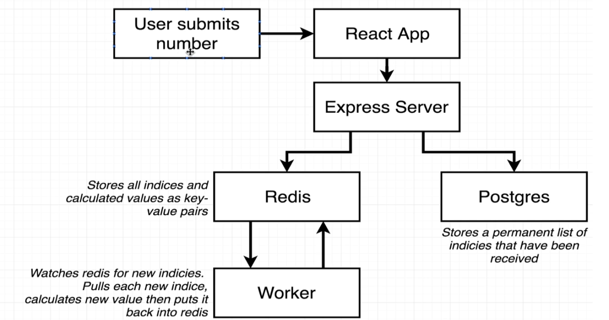
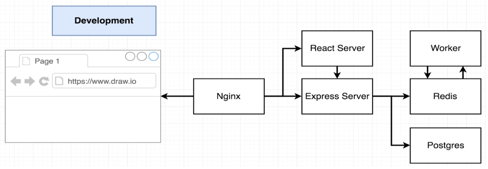
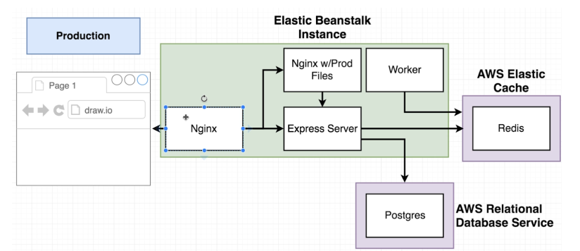
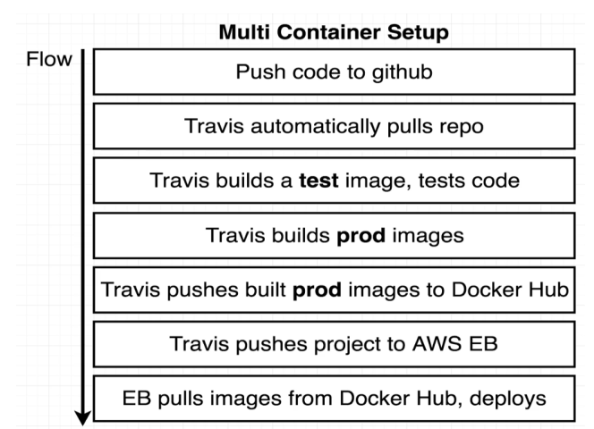
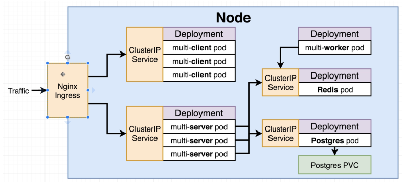
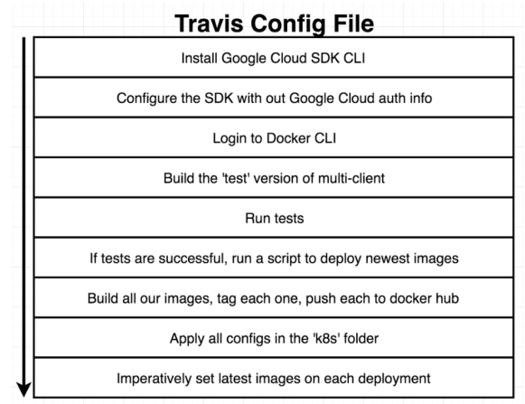

# docker-and-kubernetes-complete-guide
Files used for the Udemy course [Docker &amp; Kubernetes: The Complete Guide](https://www.udemy.com/course/docker-and-kubernetes-the-complete-guide/). 

The course involves using CI/CD pipelines with Travis, building a Fibonacci application using Dockers & Kubernetes, deploying the application using AWS & GCP and Skaffold. 

The folder structure is as follows: 
- [Section 3 - Redis Image](https://github.com/AhmadHatziq/docker-and-kubernetes-complete-guide/tree/main/3): Build a Dockerfile for a Redis container
- [Section 4 - Simple Web](https://github.com/AhmadHatziq/docker-and-kubernetes-complete-guide/tree/main/4/simpleweb): Build a HelloWorld React app using Docker. 
- [Section 5 - Visits Counter](https://github.com/AhmadHatziq/docker-and-kubernetes-complete-guide/tree/main/5/visits): Build a React app which has a visit counter stored in another Redis container. 
- [Section 6 - Docker React](https://github.com/AhmadHatziq/docker-and-kubernetes-complete-guide/tree/main/6/frontend/docker-react): Add NGINX to the previous React application. 
- [Section 8 - Fibonacci AWS](https://github.com/AhmadHatziq/docker-and-kubernetes-complete-guide/tree/main/8/complex-fibonacci-): Build a Fibonacci application that uses 6 Docker contains (NGINX, React server, Express server, Worker, Redis, Postgres). The Fibonacci application has a Travis CI/CD pipeline, which finally deploys to AWS EBS. 
  - Code repository deployed can also be found [here](https://github.com/AhmadHatziq/complex-fibonacci). 
- [Section 12 - Kubernetes Fibonacci](https://github.com/AhmadHatziq/docker-and-kubernetes-complete-guide/tree/main/12/simplek8s): A simple Kubernetes application which only has 1 pod for each component. 
- [Section 14 - Multi Container K8S](https://github.com/AhmadHatziq/docker-and-kubernetes-complete-guide/tree/main/14/multi-k8s): Multi container Fibonacci application with Kubernetes. 
- [Section 16 - K8S on GKE](https://github.com/AhmadHatziq/docker-and-kubernetes-complete-guide/tree/main/16/complex-k8s): Multi container Fibonacci application deployed to Google's Kubernetes Engine. 
  - Code repository deployed can also be found [here](https://github.com/AhmadHatziq/complex-k8s). 

The architectures and workflows are as follows: 

# Fibonacci Application Workflow

# Development Environment Architecture 

# AWS Production Environment Architecture 

## AWS Travis Workflow 

# Kubernetes GCP Production Environment Architecture 

## K8S GKE Travis Workflow 
 

Here is a simple flow chart:

